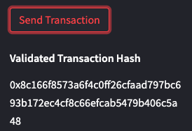

# KryptoJobs2Go: Cryptocurrency Wallet Integration

## Overview
KryptoJobs2Go is a disruptive fintech hiring platform that revolutionises the way customers find, hire, and pay fintech professionals using cryptocurrency. As the lead developer of KryptoJobs2Go, we have integrated the power of the Ethereum blockchain network into the application, enabling customers to make instant and secure payments to the fintech professionals they hire.

## Application Highlights
- **Seamless Ethereum Integration:** The KryptoJobs2Go application now seamlessly interacts with the Ethereum blockchain, allowing customers to make cryptocurrency payments to fintech professionals effortlessly.

- **Secure Digital Signatures:** Customers can securely sign payment transactions with their Ethereum account's digital signature, ensuring the authenticity and integrity of the payment process.

- **Real-Time Balance Checks:** The application provides real-time updates of the customer's Ethereum account balance, ensuring transparency and accurate payment calculations.

# Demonstration
**Initial Display**

The initial display shows the application header and the first fintech professional on the list including their wallet address, jobs rating and hourly rate, along with the employer's wallet address & balance in ether displayed at the top of the sidebar.

For the purpose of the demonstration we decided to hire Lane for 2 hours.

## Fintech Professionals List

## Sidebar Interaction

The sidebar interaction allows the employer to select a fintech professional and the number of hours they wish to hire them for.

The sidebar then displays the selected fintech professional's hourly rate, wallet address and the total wage in Ether to be paid for the selected timeframe.

## Validated Transaction hash

Once the employer clicks the "Send Transaction" button, if the transaction was successful the Validated Transaction Hash will be displayed.

## Ganache Transaction

The TX hash matches the Validated Transaction Hash generated by the Streamlit UI.

The SENDER ADDRESS matches the employer address displayed at the top of the sidebar in the streamlit UI.

The TO ADDRESS matches the fintech professionals wallet address displayed on the main page and sidebar in the streamlit UI.

## Ganache Account

The ADDRESS matches the employer address displayed at the top of the sidebar in the streamlit UI.

The Balance is 99.20 and the TX count is 2.

This is due to our initial test transaction which was also 0.4 ETH, displayed below.

**Test Transaction**

## Terminal Output

## Getting Started
To explore the full functionality of the KryptoJobs2Go application, follow these steps:

1. [Clone this repository](https://github.com/hiddenciphers/crypto_wallet.git) to your local machine using git clone.

2. Ensure you have Python 3.7 and pip installed on your machine.
Navigate to the project folder using the terminal and create a virtual environment (optional but recommended).

3. Install the required dependencies.

## Usage
1. Activate your virtual environment (if created) and run the Streamlit application: `streamlit run krypto_jobs.py`

2. Use the web interface to select a fintech professional from the drop-down menu and enter the number of hours you want to hire them for.

3. Click the "Send Transaction" button to initiate the payment transaction.

## Acknowledgements
We would like to acknowledge the support and guidance provided by the KryptoJobs2Go development team. This project would not have been possible without their collaboration and dedication.

## Conclusion
Thank you for checking out our KryptoJobs2Go Cryptocurrency Wallet Integration project! We hope you find it impressive and professional. If you encounter any issues or have any suggestions, please feel free to contact us or open an issue. Happy hiring and blockchain exploration!